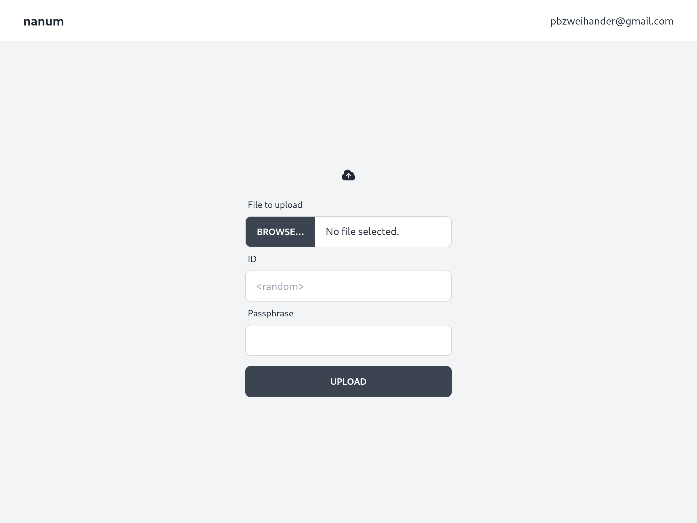

# nanum

_nanum_ is a file sharing service with client-side encryption.
Inspired by [skystar-p/hako](https://github.com/skystar-p/hako).



## Features

- Simple file sharing.
- Only authorized user can upload, but anyone can download (with passphrase).
- Use AWS S3 for persistent storage.
- No database.
- Client-side encryption using `xchacha20poly1305`.

## Usage

Install [Node.js](https://nodejs.org/), [yarn](https://yarnpkg.com/), [Trunk](https://trunkrs.dev/), and [Rust](https://www.rust-lang.org/).

```
cd frontend
yarn
trunk build
cd ../backend
ALLOWED_EMAILS=<your@email.com> \
  GITHUB_CLIENT_ID=<github client id> \
  GIHTUB_CLIENT_SECRET=<github client secret> \
  JWT_SECRET=<your secret> \
  S3_BUCKET_NAME=<s3 bucket name> \
  cargo run
```

And open http://localhost:3000/ on your browser.

## License

`nanum` is licensed under the terms of the Apache 2.0 license.
See [LICENSE](./LICENSE) file for details.
